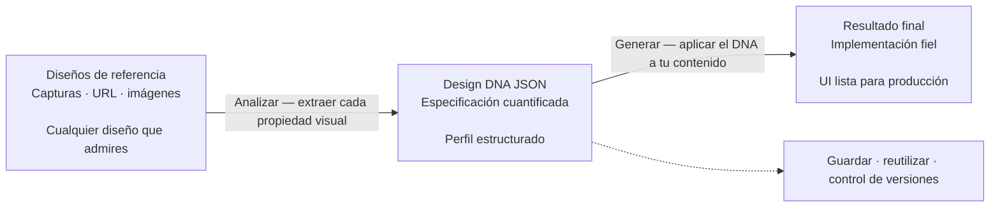

<h1 align="center">design-dna</h1>

<p align="center">
<a href="README.md">English</a> | <a href="README.zh-CN.md">中文</a> | <a href="README.ja.md">日本語</a> | <a href="README.ko.md">한국어</a> | Español | <a href="README.zh-TW.md">繁體中文</a>
</p>

Una habilidad para agentes de código que extrae, estructura y aplica la identidad visual (Design DNA) en tres dimensiones: sistema de diseño (tokens medibles), estilo de diseño (percepción cualitativa) y efectos visuales.


## Requisitos

- Entorno [Node.js](https://nodejs.org/) instalado
- Poder ejecutar comandos `npx`

## Instalación

### Instalación rápida (recomendada)

```bash
npx skills add zanwei/design-dna
```

### Instalar en un agente concreto

```bash
# Solo Cursor, no interactivo, instalación global
npx skills add zanwei/design-dna -a cursor -g -y

# Solo Claude Code
npx skills add zanwei/design-dna -a claude-code -g -y
```

### Instalar desde un clon local

```bash
git clone https://github.com/zanwei/design-dna.git
npx skills add ./design-dna -y
```

### Listar habilidades disponibles

```bash
npx skills add zanwei/design-dna --list
```

## Qué hace

| Dimensión | Rol |
|-----------|-----|
| **Sistema de diseño** | Tokens medibles: color, tipografía, espaciado, layout, forma, elevación, movimiento, componentes, etc. |
| **Estilo de diseño** | Descripción cualitativa: estado de ánimo, lenguaje visual, composición, estilo de imagen, tacto de la interacción, voz de marca, etc. |
| **Efectos visuales** | Más allá del CSS habitual: Canvas, WebGL, 3D, partículas, sombreadores, movimiento ligado al scroll, efectos de cursor, animación SVG, glassmorfismo, etc. |

La habilidad incorpora un flujo de trabajo en **tres fases**:

1. **Estructura** — Presenta el esquema completo y el significado de cada campo (ver `references/schema.md`).
2. **Analizar** — A partir de capturas, imágenes o URL, produce un perfil JSON con todos los campos (sin vacíos; si hay conflictos entre referencias, indica la opción principal y las variantes).
3. **Generar** — Con el JSON de DNA y el contenido, implementa el diseño (por defecto: HTML/CSS/JS autocontenido) siguiendo las comprobaciones de calidad de `references/generation-guide.md`.

Las fases se pueden usar por separado o encadenadas (p. ej., Analizar → Generar).

## Cómo funciona

Visión general del flujo (GitHub renderiza el diagrama [Mermaid](https://github.blog/news-insights/product-news/github-now-supports-mermaid-diagrams-in-markdown/) siguiente):



**Paso 1 — Reunir referencias.** Prepara capturas, imágenes o enlaces a páginas en vivo de diseños cuya identidad visual quieras capturar. Puedes combinar varias referencias; la habilidad identifica patrones dominantes y anota variantes.

**Paso 2 — Extraer DNA.** Entrega las referencias al agente. Inspecciona cada propiedad visual en las tres dimensiones y genera un Design DNA JSON completo y cuantificado, sin campos vacíos ni conjeturas. Ese JSON es una especificación de diseño portable y reutilizable.

**Paso 3 — Generar desde el DNA.** Proporciona el JSON de DNA junto con tu propio contenido. El agente produce implementaciones que reproducen fielmente el lenguaje de diseño original adaptándose a tu material y copy.

El JSON de DNA es el artefacto central. Una vez extraído, puede **versionarse**, **compartirse entre equipos**, **reutilizarse en varios proyectos** y **refinarse de forma iterativa**, convirtiendo un «hazlo como ese sitio» subjetivo en una especificación precisa y reproducible que cualquier agente puede consumir.

> [!TIP]
> **Enriquecer el aspecto visual.** Si el primer resultado sigue pareciendo pobre o poco detallado frente a las referencias, inicia una **iteración de pulido** explícita: vuelve a adjuntar **las mismas URL o capturas**. Así reduces la distancia entre un borrador usable y un resultado rico y fiel a la referencia sin empezar de cero.
>
> **Prompt:** **Frente a la referencia, revisa jerarquía, ornamentación, ritmo tipográfico, movimiento, materialidad y la UI en conjunto; luego incorpora tus conclusiones a la implementación actual.**

## Compatibilidad

Cumple la [especificación Agent Skills](https://agentskills.io). Instalable con la [CLI `skills`](https://github.com/vercel-labs/skills) en todos los [agentes compatibles](https://github.com/vercel-labs/skills#supported-agents), incluidos Cursor, Claude Code, Codex, GitHub Copilot y [más de 40](https://github.com/vercel-labs/skills#supported-agents).

## Contribuciones

Las issues y pull requests son bienvenidas. Si cambias el comportamiento de la habilidad, actualiza `SKILL.md` y los archivos afectados en `references/` para mantener coherencia entre documentación y comportamiento.

## Licencia

MIT

## Historial de estrellas

[](https://star-history.com/#zanwei/design-dna&Date)
