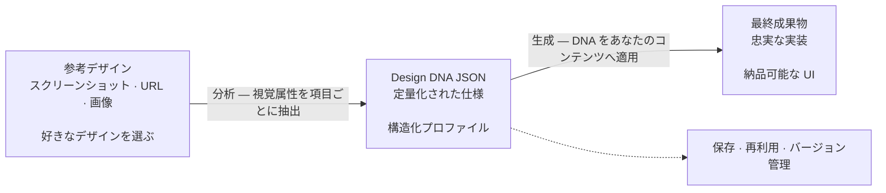

<h1 align="center">design-dna</h1>

<p align="center">
<a href="README.md">English</a> | <a href="README.zh-CN.md">中文</a> | 日本語 | <a href="README.ko.md">한국어</a> | <a href="README.es.md">Español</a> | <a href="README.zh-TW.md">繁體中文</a>
</p>

コーディングエージェント向けのスキルで、視覚的なデザインアイデンティティ（Design DNA）を抽出・構造化・適用します。三つの次元をカバーします：デザインシステム（測定可能なトークン）、デザインスタイル（定性的な印象）、ビジュアルエフェクト。


## 前提条件

- [Node.js](https://nodejs.org/) 環境がインストールされていること
- `npx` コマンドを実行できること

## インストール

### クイックインストール（推奨）

```bash
npx skills add zanwei/design-dna
```

### 特定のエージェントへインストール

```bash
# Cursor のみ、非対話、グローバルインストール
npx skills add zanwei/design-dna -a cursor -g -y

# Claude Code のみ
npx skills add zanwei/design-dna -a claude-code -g -y
```

### ローカルクローンからインストール

```bash
git clone https://github.com/zanwei/design-dna.git
npx skills add ./design-dna -y
```

### 利用可能なスキルを一覧表示

```bash
npx skills add zanwei/design-dna --list
```

## 機能概要

| 次元 | 説明 |
|------|------|
| **デザインシステム** | 測定可能なトークン：色、タイポグラフィ、余白、レイアウト、形状、階層、モーション、コンポーネントなど |
| **デザインスタイル** | 定性的な記述：ムード、ビジュアル言語、構図、イメージの質感、インタラクションの手触り、ブランドの声など |
| **ビジュアルエフェクト** | 通常の CSS を超える実装：Canvas、WebGL、3D、パーティクル、シェーダー、スクロール連動モーション、カーソル効果、SVG アニメーション、グラスモーフィズムなど |

スキルは **三フェーズ** のワークフローを内蔵しています。

1. **構造** — 完全なスキーマと各フィールドの意味を提示（`references/schema.md` を参照）。
2. **分析** — スクリーンショット、画像、または URL に基づき、フィールドが揃った JSON プロファイルを出力（空欄なし。複数参考で競合する場合は主案とバリアントを明記）。
3. **生成** — 既存の DNA JSON とコンテンツを前提に実装へ落とし込む（デフォルト：自己完結型 HTML/CSS/JS）。`references/generation-guide.md` の品質チェックに従う。

各フェーズは単独でも、連結（例：分析 → 生成）でも利用できます。

## 仕組み

フロー概要（GitHub は以下の [Mermaid](https://github.blog/news-insights/product-news/github-now-supports-mermaid-diagrams-in-markdown/) 図をレンダリングできます）：



**ステップ 1 — 参考の収集。** 参考にしたいデザインのスクリーンショット、画像、または公開ページのリンクを用意します。複数の参考を同時に渡せます。スキルは支配的なパターンを識別し、差異を注記します。

**ステップ 2 — DNA の抽出。** 参考素材をエージェントに渡します。三つの次元の各視覚属性を項目ごとに検査し、完全かつ定量化された Design DNA JSON を出力します。空欄はなく、推測に頼りません。この JSON が移植可能で再利用可能なデザイン仕様です。

**ステップ 3 — DNA からの生成。** DNA JSON と独自のコンテンツをセットで渡すと、エージェントは元のデザイン言語を忠実に再現しつつ、あなたの素材とコピーに合わせた実装を生成します。

DNA JSON が中核のアーティファクトです。一度抽出すれば、**バージョン管理にコミットしたり**、**チームで共有したり**、**複数プロジェクトで再利用したり**、**継続的に微調整したり**できます。主観的な「あのサイトみたいに」を、正確で再現可能な仕様に変え、どのエージェントもそれに沿って一貫したデザインを安定して出力できます。

> [!TIP]
> **視覚的な精緻化。** 初回の成果物が参考に比べてまだ薄い、あるいはディテールが足りないと感じる場合は、**同じ参考リンクやスクリーンショット**をエージェントに再度渡し、明確な**精緻化ラウンド**を行ってください。初稿を活かしたまま、「高忠実度の参照」にかなり近づけられ、最初からやり直す必要はありません。
>
> **プロンプト例：** **参考と照らし合わせ、界面の階層と装飾、字階と余白、モーションとマテリアリティ、および UI 全体を再監査し、結論を現在の実装へ反映してください。**

## 互換性

[Agent Skills 仕様](https://agentskills.io) に準拠。[`skills` CLI](https://github.com/vercel-labs/skills) から、[対応エージェント](https://github.com/vercel-labs/skills#supported-agents) すべてにインストール可能です。Cursor、Claude Code、Codex、GitHub Copilot など [40 種類以上](https://github.com/vercel-labs/skills#supported-agents) に対応しています。

## コントリビューション

Issue と Pull Request を歓迎します。スキルの挙動を変更する場合は、`SKILL.md` と `references/` 内の関連ファイルを更新し、ドキュメントと挙動の一致を保ってください。

## ライセンス

MIT

## Star 履歴

[](https://star-history.com/#zanwei/design-dna&Date)
