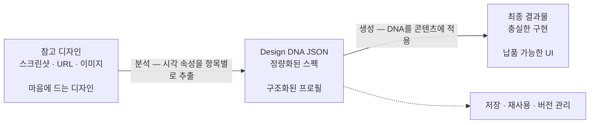

<h1 align="center">design-dna</h1>

<p align="center">
<a href="README.md">English</a> | <a href="README.zh-CN.md">中文</a> | <a href="README.ja.md">日本語</a> | 한국어 | <a href="README.es.md">Español</a> | <a href="README.zh-TW.md">繁體中文</a>
</p>

코딩 에이전트를 위한 스킬로, 시각적 디자인 아이덴티티(Design DNA)를 추출·구조화·적용합니다. 세 가지 차원을 다룹니다: 디자인 시스템(측정 가능한 토큰), 디자인 스타일(정성적 인상), 비주얼 이펙트.


## 사전 요구 사항

- [Node.js](https://nodejs.org/) 환경이 설치되어 있을 것
- `npx` 명령을 실행할 수 있을 것

## 설치

### 빠른 설치(권장)

```bash
npx skills add zanwei/design-dna
```

### 특정 에이전트에 설치

```bash
# Cursor만, 비대화형, 전역 설치
npx skills add zanwei/design-dna -a cursor -g -y

# Claude Code만
npx skills add zanwei/design-dna -a claude-code -g -y
```

### 로컬 클론에서 설치

```bash
git clone https://github.com/zanwei/design-dna.git
npx skills add ./design-dna -y
```

### 사용 가능한 스킬 목록

```bash
npx skills add zanwei/design-dna --list
```

## 기능 개요

| 차원 | 설명 |
|------|------|
| **디자인 시스템** | 측정 가능한 토큰: 색, 타이포그래피, 여백, 레이아웃, 형태, 깊이, 모션, 컴포넌트 등 |
| **디자인 스타일** | 정성적 서술: 무드, 비주얼 언어, 구도, 이미지 질감, 인터랙션 느낌, 브랜드 톤 등 |
| **비주얼 이펙트** | 일반 CSS를 넘어서: Canvas, WebGL, 3D, 파티클, 셰이더, 스크롤 연동 모션, 커서 효과, SVG 애니메이션, 글래스모피즘 등 |

스킬은 **3단계** 워크플로를 내장합니다.

1. **구조** — 전체 스키마와 각 필드 의미를 제시(`references/schema.md` 참고).
2. **분석** — 스크린샷, 이미지 또는 URL로 필드가 채워진 JSON 프로필을 출력(빈 칸 없음. 다중 참고 충돌 시 주안과 변형을 명시).
3. **생성** — 기존 DNA JSON과 콘텐츠를 전제로 구현(기본: 자급족 HTML/CSS/JS). `references/generation-guide.md`의 품질 검사를 따름.

각 단계는 단독으로도, 연결(예: 분석 → 생성)으로도 사용할 수 있습니다.

## 작동 방식

흐름 개요(GitHub는 아래 [Mermaid](https://github.blog/news-insights/product-news/github-now-supports-mermaid-diagrams-in-markdown/) 다이어그램을 렌더링합니다):



**1단계 — 참고 수집.** 따르고 싶은 디자인의 스크린샷, 이미지 또는 공개 페이지 링크를 준비합니다. 여러 참고를 동시에 제공할 수 있으며, 스킬은 주도 패턴을 식별하고 차이를 표기합니다.

**2단계 — DNA 추출.** 참고 자료를 에이전트에 넘기면 세 차원의 각 시각 속성을 항목별로 검사하고, 완전하고 정량화된 Design DNA JSON을 출력합니다. 빈 필드나 추측에 의존하지 않습니다. 이 JSON이 이식 가능하고 재사용 가능한 디자인 사양입니다.

**3단계 — DNA로부터 생성.** DNA JSON과 자체 콘텐츠를 함께 제공하면 에이전트는 원래 디자인 언어를 충실히 재현하면서 소재와 카피에 맞춥니다.

DNA JSON이 핵심 산출물입니다. 한 번 추출하면 **버전 관리에 커밋**하거나, **팀 간 공유**하거나, **여러 프로젝트에서 재사용**하거나, **지속적으로 미세 조정**할 수 있습니다. 주관적인 「그 사이트처럼」을 정확하고 재현 가능한 사양으로 바꿔, 어떤 에이전트도 일관된 디자인을 안정적으로 내보낼 수 있게 합니다.

> [!TIP]
> **시각적 다듬음.** 첫 결과가 참고에 비해 여전히 얇거나 디테일이 부족하다면, **같은 참고 링크나 스크린샷**을 에이전트에 다시 제공해 명확한 **다듬음 라운드**를 진행하세요. 초안을 유지한 채 「고충실도 참고」에 훨씬 가까워질 수 있으며 처음부터 다시 할 필요는 없습니다.
>
> **프롬프트 예:** **참고와 대조하여 화면 계층과 장식, 자간·여백, 모션과 재질감, 전체 UI를 재검토하고 결론을 현재 구현에 반영해 주세요.**

## 호환성

[Agent Skills 사양](https://agentskills.io)을 따릅니다. [`skills` CLI](https://github.com/vercel-labs/skills)로 [지원 에이전트](https://github.com/vercel-labs/skills#supported-agents) 전체에 설치할 수 있습니다. Cursor, Claude Code, Codex, GitHub Copilot 등 [40종 이상](https://github.com/vercel-labs/skills#supported-agents)을 지원합니다.

## 기여

Issue와 Pull Request를 환영합니다. 스킬 동작을 바꿀 때는 `SKILL.md`와 `references/`의 관련 파일을 함께 업데이트해 문서와 동작을 맞추세요.

## 라이선스

MIT

## Star 히스토리

[](https://star-history.com/#zanwei/design-dna&Date)
