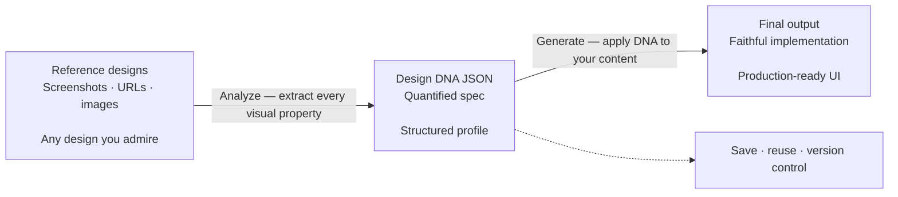

<h1 align="center">design-dna</h1>


https://github.com/user-attachments/assets/00e0a28d-42ce-4a08-a0c0-1ecf8b9f7e97


<h3 align="center">Other cases</h3>

https://github.com/user-attachments/assets/80793608-930d-42ca-951f-eb21ac188d54

https://github.com/user-attachments/assets/cd4cba94-cd2c-480f-8efa-4ac86e00ae1f

English | [中文](README.zh-CN.md)

An agent skill for extracting, structuring, and applying visual design identity as machine-readable "Design DNA" across three dimensions: design tokens, qualitative style, and visual effects.

## Prerequisites

- [Node.js](https://nodejs.org/) environment installed
- Ability to run `npx` commands

## Installation

### Quick Install (Recommended)

```bash
npx skills add zanwei/design-dna
```

### Install to Specific Agent

```bash
# Cursor only, non-interactive, global install
npx skills add zanwei/design-dna -a cursor -g -y

# Claude Code only
npx skills add zanwei/design-dna -a claude-code -g -y
```

### Install from Local Clone

```bash
git clone https://github.com/zanwei/design-dna.git
npx skills add ./design-dna -y
```

### List Available Skills

```bash
npx skills add zanwei/design-dna --list
```

## What It Does

| Dimension | Role |
|-----------|------|
| **Design System** | Measurable tokens: color, typography, spacing, layout, shape, elevation, motion, components |
| **Design Style** | Qualitative perception: mood, visual language, composition, imagery, interaction feel, brand voice |
| **Visual Effects** | Beyond plain CSS: Canvas, WebGL, 3D, particles, shaders, scroll-driven motion, cursor effects, SVG animation, glassmorphism, etc. |

The skill drives a **three-phase** workflow:

1. **Structure** — Surface the full schema and field meanings (see `references/schema.md`).
2. **Analyze** — From screenshots, images, or URLs, produce a complete JSON profile (every field filled; conflicts noted).
3. **Generate** — Given DNA JSON plus content, implement the design (default: self-contained HTML/CSS/JS), following `references/generation-guide.md`.

Phases can be used alone or chained (e.g. Analyze → Generate).

## How It Works

Pipeline at a glance ([Mermaid](https://github.blog/news-insights/product-news/github-now-supports-mermaid-diagrams-in-markdown/) renders on GitHub):



**Step 1 — Curate references.** Collect screenshots, images, or live URLs of designs whose visual identity you want to capture. Multiple references can be combined; the skill identifies dominant patterns and notes variants.

**Step 2 — Extract DNA.** Feed the references to the agent. It inspects every visual property across all three dimensions and outputs a complete, quantified Design DNA JSON — no empty fields, no guesswork. This JSON becomes a portable, reusable design specification.

**Step 3 — Generate from DNA.** Provide the DNA JSON together with your own content. The agent produces implementations that faithfully reproduce the original design language while adapting to your material.

The DNA JSON is the key artifact. Once extracted, it can be **committed to version control**, **shared across teams**, **reused across projects**, and **iteratively refined** — turning subjective "make it look like that site" into a precise, reproducible specification that any agent can consume.

> [!TIP]
> **Refining visual richness.** If the first pass still feels visually thin or under-detailed next to your references, run a deliberate **polish iteration**: re-attach the **same URLs or screenshots**. This narrows the gap between a workable draft and a reference-faithful, visually rich result without starting over.
>
> **Prompt:** **Against the reference, audit hierarchy, ornamentation, typographic rhythm, motion, materiality, and overall UI—then merge your conclusions back into the current implementation.**

## Compatibility

Follows the [Agent Skills specification](https://agentskills.io). Installable via [`skills` CLI](https://github.com/vercel-labs/skills) to all [supported agents](https://github.com/vercel-labs/skills#supported-agents) including Cursor, Claude Code, Codex, GitHub Copilot, and [39 more](https://github.com/vercel-labs/skills#supported-agents).

## Contributing

Issues and pull requests are welcome. For substantive behavior changes, update `SKILL.md` and any affected files under `references/` so the skill stays internally consistent.

## License

MIT
