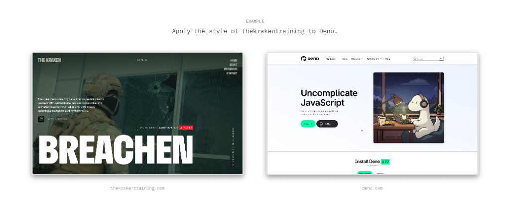
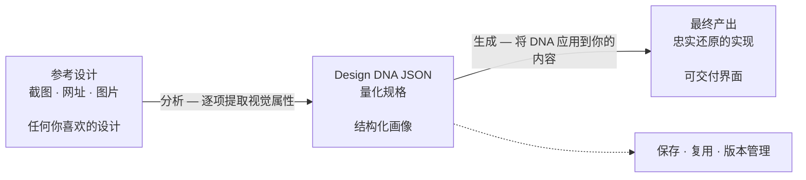

<h1 align="center">design-dna</h1>



[English](README.md) | 中文

面向编程智能体的技能，用于提取、结构化并应用视觉设计身份（Design DNA），覆盖三个维度：设计系统（可度量 token）、设计风格（定性感受）与视觉特效。

## 前置条件

- 已安装 [Node.js](https://nodejs.org/) 环境
- 能够运行 `npx` 命令

## 安装

### 快速安装（推荐）

```bash
npx skills add zanwei/design-dna
```

### 安装到指定智能体

```bash
# 仅 Cursor，非交互，全局安装
npx skills add zanwei/design-dna -a cursor -g -y

# 仅 Claude Code
npx skills add zanwei/design-dna -a claude-code -g -y
```

### 从本地克隆安装

```bash
git clone https://github.com/zanwei/design-dna.git
npx skills add ./design-dna -y
```

### 列出可用技能

```bash
npx skills add zanwei/design-dna --list
```

## 功能说明

| 维度 | 说明 |
|------|------|
| **设计系统** | 可度量 token：色彩、字体、间距、版式、形状、层级、动效、组件等 |
| **设计风格** | 定性描述：情绪、视觉语言、构图、图像风格、交互气质、品牌语气等 |
| **视觉特效** | 超出普通 CSS 的实现：Canvas、WebGL、3D、粒子、着色器、滚动驱动动效、光标效果、SVG 动画、玻璃拟态等 |

技能内置 **三阶段** 工作流：

1. **结构** — 展示完整 schema 与各字段含义（见 `references/schema.md`）。
2. **分析** — 根据截图、图片或 URL，输出字段齐全的 JSON 画像（无空字段；多参考冲突时注明主方案与变体）。
3. **生成** — 在已有 DNA JSON + 内容的前提下落地实现（默认：自包含 HTML/CSS/JS），并遵循 `references/generation-guide.md` 中的质量检查。

各阶段可单独使用，也可串联（例如：分析 → 生成）。

## 工作原理

流程一览（GitHub 会渲染下方 [Mermaid](https://github.blog/news-insights/product-news/github-now-supports-mermaid-diagrams-in-markdown/) 图）：



**第一步 — 收集参考。** 准备你欣赏的设计截图、图片或线上页面链接。可以同时提供多份参考，技能会识别主导模式并标注差异。

**第二步 — 提取 DNA。** 将参考素材交给智能体，它会逐项检视三个维度的每一项视觉属性，输出一份完整且量化的 Design DNA JSON — 没有空字段、没有猜测。这份 JSON 就是一份可移植、可复用的设计规格。

**第三步 — 基于 DNA 生成。** 将 DNA JSON 与你自己的内容一同提供，智能体会生成忠实还原原始设计语言的实现，同时适配你的素材与文案。

DNA JSON 是核心产物。一旦提取完成，它可以**提交到版本控制**、**跨团队共享**、**在多个项目中复用**，也可以**持续迭代微调** — 把主观的「照着那个网站做」变成一份精确、可复现的规格定义，任何智能体都能据此稳定输出一致的设计。

> [!TIP]
> **视觉精修提示。** 若首轮产出相对参考仍显单薄或细节不足，可将**同一批参考链接或截图**再次提供给智能体，发起明确的**精修轮次**；可在保留初稿的前提下显著拉近与「高保真参照」的差距，无需从零重做。
>
> **Prompt：** **请其对照参考复审界面层级与点缀、字阶与留白、动效与材质及整体 UI，并将结论回填至当前实现。**

## 兼容性

符合 [Agent Skills 规范](https://agentskills.io)。可通过 [`skills` CLI](https://github.com/vercel-labs/skills) 安装到所有[支持的智能体](https://github.com/vercel-labs/skills#supported-agents)，包括 Cursor、Claude Code、Codex、GitHub Copilot 等 [40+ 款](https://github.com/vercel-labs/skills#supported-agents)。

## 贡献

欢迎提 Issue 与 Pull Request。若修改技能行为，请同步更新 `SKILL.md` 及 `references/` 下相关文件，保持文档与行为一致。

## 许可证

MIT
