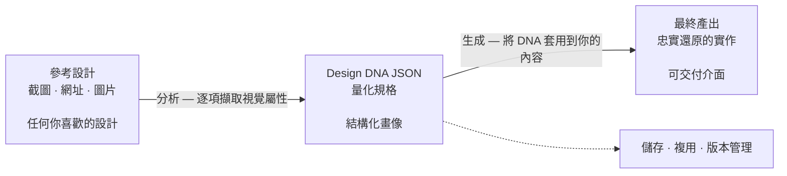

<h1 align="center">design-dna</h1>

<p align="center">
<a href="README.md">English</a> | <a href="README.zh-CN.md">中文</a> | <a href="README.ja.md">日本語</a> | <a href="README.ko.md">한국어</a> | <a href="README.es.md">Español</a> | 繁體中文
</p>

面向程式編寫代理人的技能，用於擷取、結構化並套用視覺設計身分（Design DNA），涵蓋三個維度：設計系統（可度量 token）、設計風格（定性感受）與視覺特效。


## 前置條件

- 已安裝 [Node.js](https://nodejs.org/) 環境
- 能夠執行 `npx` 指令

## 安裝

### 快速安裝（建議）

```bash
npx skills add zanwei/design-dna
```

### 安裝到指定代理人

```bash
# 僅 Cursor，非互動，全域安裝
npx skills add zanwei/design-dna -a cursor -g -y

# 僅 Claude Code
npx skills add zanwei/design-dna -a claude-code -g -y
```

### 從本機複製安裝

```bash
git clone https://github.com/zanwei/design-dna.git
npx skills add ./design-dna -y
```

### 列出可用技能

```bash
npx skills add zanwei/design-dna --list
```

## 功能說明

| 維度 | 說明 |
|------|------|
| **設計系統** | 可度量 token：色彩、字體、間距、版式、形狀、層級、動效、元件等 |
| **設計風格** | 定性描述：情緒、視覺語言、構圖、影像風格、互動氣質、品牌語氣等 |
| **視覺特效** | 超出一般 CSS 的實作：Canvas、WebGL、3D、粒子、著色器、捲動驅動動效、游標效果、SVG 動畫、玻璃擬態等 |

技能內建 **三階段** 工作流程：

1. **結構** — 展示完整 schema 與各欄位意義（見 `references/schema.md`）。
2. **分析** — 依截圖、圖片或 URL，輸出欄位齊備的 JSON 畫像（無空欄位；多份參考衝突時註明主方案與變體）。
3. **生成** — 在已有 DNA JSON 與內容的前提下落地實作（預設：自包含 HTML/CSS/JS），並遵循 `references/generation-guide.md` 中的品質檢查。

各階段可單獨使用，亦可串聯（例如：分析 → 生成）。

## 工作原理

流程一覽（GitHub 會渲染下方 [Mermaid](https://github.blog/news-insights/product-news/github-now-supports-mermaid-diagrams-in-markdown/) 圖）：



**第一步 — 收集參考。** 準備你欣賞的設計截圖、圖片或線上頁面連結。可同時提供多份參考；技能會辨識主導模式並標註差異。

**第二步 — 擷取 DNA。** 將參考素材交給代理人，它會逐項檢視三個維度下的每一項視覺屬性，輸出一份完整且量化的 Design DNA JSON — 沒有空欄位、沒有猜測。這份 JSON 就是一份可移植、可複用的設計規格。

**第三步 — 依 DNA 生成。** 將 DNA JSON 與你自己的內容一併提供，代理人會產出忠實還原原始設計語言的實作，同時適配你的素材與文案。

DNA JSON 是核心產物。一旦擷取完成，它可以**提交到版本控制**、**跨團隊共享**、**在多個專案中複用**，也可以**持續迭代微調** — 把主觀的「照著那個網站做」變成一份精確、可重現的規格定義，任何代理人都能據此穩定輸出一致的設計。

> [!TIP]
> **視覺精修提示。** 若首輪產出相對參考仍顯單薄或細節不足，可將**同一批參考連結或截圖**再次提供給代理人，發起明確的**精修輪次**；可在保留初稿的前提下顯著拉近與「高保真參照」的差距，無需從零重做。
>
> **Prompt：** **請其對照參考複審介面層級與點綴、字階與留白、動效與材質及整體 UI，並將結論回填至目前實作。**

## 相容性

符合 [Agent Skills 規範](https://agentskills.io)。可透過 [`skills` CLI](https://github.com/vercel-labs/skills) 安裝到所有[支援的代理人](https://github.com/vercel-labs/skills#supported-agents)，包括 Cursor、Claude Code、Codex、GitHub Copilot 等 [40+ 款](https://github.com/vercel-labs/skills#supported-agents)。

## 貢獻

歡迎提交 Issue 與 Pull Request。若修改技能行為，請同步更新 `SKILL.md` 及 `references/` 下相關檔案，保持文件與行為一致。

## 授權

MIT

## 星標歷史

[](https://star-history.com/#zanwei/design-dna&Date)
