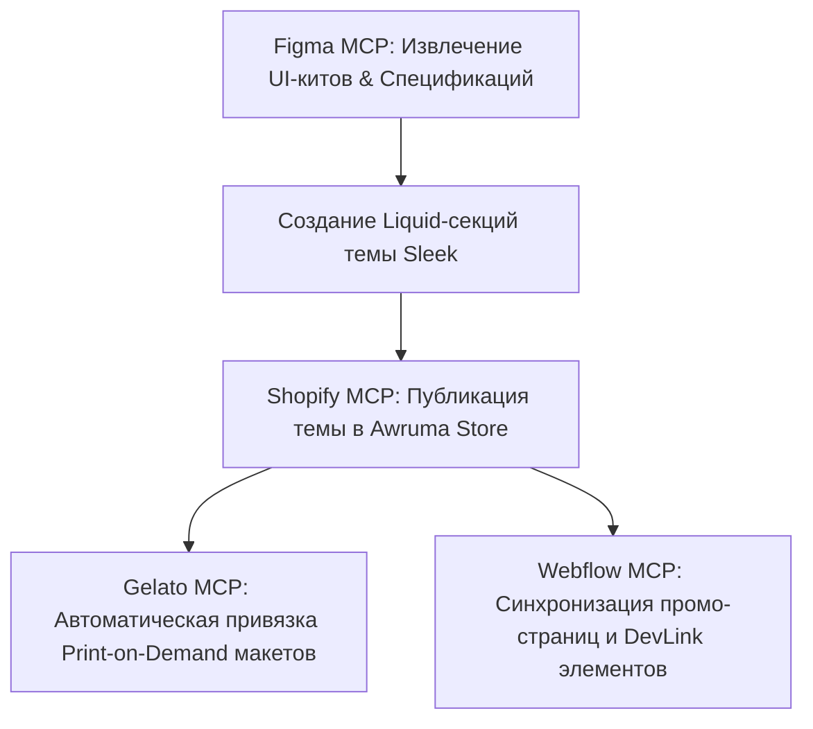

# 🛍️ Shopify Sleek Theme — Архитектура и Руководство Разработки

> **Цель проекта:** Полное воссоздание и оптимизация премиальной Shopify темы **Sleek** ($350 USD, by FoxEcom) с нуля для интернет-магазина **Awruma** (`awruma.myshopify.com`).

---

## 📐 1. Концепция и Визуальный Стиль Sleek

Тема **Sleek** разработана специально для премиальных брендов (Beauty, Art & Home Decor, Fashion), требующих эстетичной подачи товаров, высокой скорости загрузки и продуманного UX для максимальной конверсии.

### 🎨 Дизайн-система и Токены:
* **Типографика:** Сочетание современной гротескной гарнитуры (*Inter / Outfit / Plus Jakarta Sans*) для заголовков и интерфейсов.
* **Цветовая палитра:**
  * `Canvas Primary`: `#FFFFFF` / `Dark: #0F0F11`
  * `Canvas Secondary`: `#F8F8F9` / `Dark: #18181B`
  * `Accent Brand`: `#111111` (Контрастные кнопки и банеры)
  * `Text Primary`: `#09090B`
  * `Text Secondary`: `#71717A`
* **Микро-анимации:** Плавный hover-эффект на карточках товаров (смена ракурсов/заливки), выезжающая шторка корзины (Slide-out Cart), масштабирование фото при скролле.

---

## 🛠️ 2. Архитектура Shopify Liquid 2.0 Темы

Структура темы разрабатывается по стандарту **Shopify Theme Online Store 2.0**:

```text
/root/awruma-sleek-theme/
├── assets/
│   ├── theme.css               # Главные CSS-стили и переменные
│   ├── theme.js                # Модульный JavaScript (ESM)
│   ├── cart-drawer.js          # Логика корзины Slide-out Cart
│   └── gsap-core.js            # Анимации и плавные переходы
├── config/
│   ├── settings_data.json      # Настройки темы по умолчанию
│   └── settings_schema.json    # Настройки кастомизации в Shopify Admin
├── layout/
│   ├── theme.liquid            # Главный макет страниц
│   └── password.liquid         # Страница заглушки/доступа
├── locales/
│   ├── en.default.json         # Английская локализация
│   └── ru.json                 # Русская локализация
├── sections/
│   ├── header-mega-menu.liquid # Фиксированный шапка и мега-меню
│   ├── hero-banner.liquid      # Главный интерактивный баннер
│   ├── featured-products.liquid# Сетка популярных товаров (A2, A1, A0)
│   ├── before-after.liquid     # Слайдер сравнения макетов/интерьеров
│   ├── lookbook-grid.liquid    # Интерактивные лукбуки с покупкой в 1 клик
│   ├── slideout-cart.liquid    # Боковая выезжающая корзина
│   ├── quick-view-modal.liquid # Окно быстрого просмотра
│   ├── faq-accordion.liquid    # Вопросы и ответы
│   └── footer.liquid           # Подвал сайта
├── snippets/
│   ├── product-card.liquid     # Компонент карточки товара
│   ├── color-swatches.liquid   # Выбор вариантов/цветов
│   ├── size-pills.liquid       # Пилюли выбора размеров (A2, A1, A0)
│   ├── price.liquid            # Форматирование цен ($29.99 - $79.99)
│   └── trust-badges.liquid     # Бейджи доверия и гарантии
└── templates/
    ├── index.json              # Конструктор главной страницы
    ├── product.json            # Шаблон страницы товара
    ├── collection.json         # Шаблон каталога
    └── cart.json               # Корзина
```

---

## ⚡ 3. Ключевые Функциональные Модули Sleek

### 🛒 3.1 Slide-out Cart Drawer (Выезжающая Корзина)
* Прогресс-бар до бесплатной доставки (*"Добавьте ещё $20 до бесплатной доставки!"*).
* Блок ввода заметок к заказу (Cart Notes).
* Переключатель подарочной упаковки (Gift wrapping).
* Допродажи в корзине (Upsell recommendations) в 1 клик.

### 🖼️ 3.2 Карточка товара (Product Card & Page)
* **Размеры холстов и постеров Awruma:**
  * **A2 (42.0×59.4 см)** — `$29.99`
  * **A1 (59.4×84.1 см)** — `$59.99`
  * **A0 (84.1×118.9 см)** — `$79.99`
* Быстрый выбор размеров через интерактивные пилюли (`Size Pills`).
* Индикатор наличия (`Live Stock Counter`) для создания FOMO-эффекта.
* Быстрый просмотр (`Quick View Modal`) без перехода на новую страницу.

### 🔄 3.3 Интерактивный Слайдер Before / After
* Наглядная демонстрация картин и плакатов в пустом интерьере и готовом дизайне комнаты.

---

## 🔌 4. Интеграция с MCP Экосистемой (Shopify + Gelato + Webflow + Figma)



1. **Shopify MCP (`shopify`):** Прямая загрузка темы, продуктов, коллекций и управление Admin API.
2. **Gelato MCP (`gelato`):** Авто-маршрутизация заказов печати холстов A2/A1/A0.
3. **Figma MCP (`figma`):** Парсинг макетов элементов темы Sleek и экспорт SVG/PNG графики.
4. **Webflow MCP (`webflow`):** Публикация витрин и посадочных страниц.

---

## 🚀 5. План Реализации по Шагам

- [ ] **Шаг 1:** Создание базового каркаса темы Shopify Liquid 2.0.
- [ ] **Шаг 2:** Разработка стилей `theme.css` и JavaScript-модулей (`cart-drawer.js`, `quick-view.js`).
- [ ] **Шаг 3:** Верстка ключевых секций (Hero Banner, Product Grid, Slide-out Cart, Before/After Slider).
- [ ] **Шаг 4:** Подключение и тестирование темы в магазине **Awruma** (`awruma.myshopify.com`) через Shopify API.

---

✅ **Документ добавлен в базу знаний Obsidian (`Vibe Design/Shopify/`).**
