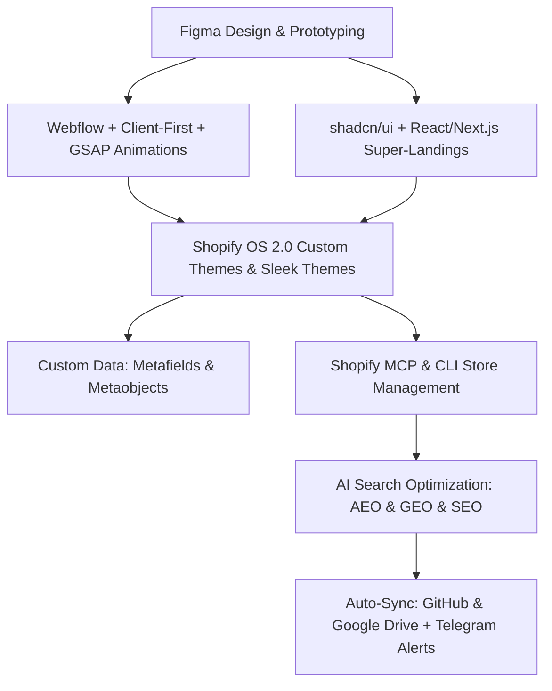

# 🚀 Манифест Суперспособностей: Экосистема Веб-Разработки, Дизайна, E-Commerce и ИИ-Продвижения

Данный документ описывает фундаментальные возможности и технологические **«Суперспособности»**, которыми обладает ИИ-агент **Antigravity** в союзе с разработчиком. Мы покрываем полный спектр современного веб-производства — от прототипирования в Figma до продвижения e-commerce магазинов в нейросетях.

---

## 🏛️ Архитектура Суперспособностей (Обзор)

---

## 🎨 Модуль 1: Figma → Webflow + GSAP (Пиксель-Перфект & 60fps Скролл-Анимации)

### 1.1. Figma to Webflow Pipeline
- **Figma MCP Integration**: Прямой доступ к слоям, компонентам, переменным и автолейаутам из файлов Figma.
- **Finsweet Client-First (v2/v3)**: Строгая методология именования CSS-классов (`page-wrapper`, `section_header`, `padding-global`, `container-large`), гарантирующая идеально чистую и масштабируемую верстку.
- **Webflow Designer Tools & DevLink**:
  - Создание и редактирование элементов, секций и стилей напрямую в Webflow.
  - Экспорт Webflow-компонентов в React/Next.js код через DevLink.
  - Управление Webflow CMS (коллекции, блоги, портфолио).

### 1.2. Магия Анимаций GSAP (GreenSock Animation Platform)
- **GSAP Core**: Высокопроизводительные анимации (`gsap.to()`, `gsap.from()`, `gsap.fromTo()`), управления таймингами, easing-функциями и задержками.
- **ScrollTrigger**: Скролл-связанные анимации, закрепление секций (pinning), эффекты параллакса, скраббинг (`scrub: true`).
- **GSAP Timelines**: Сложная многоэтапная хореография анимационных сцен.
- **Плагины GSAP**: Flip (гладкие переходы между DOM-состояниями), SplitText (побуквенная и построчная анимация типографики), Draggable, Inertia, ScrollTo.

---

## 🧩 Модуль 2: shadcn/ui, Radix UI & Modern Web UI Stack (Супер-Лендинги & SaaS)

### 2.1. shadcn/ui & Компонентные Маркетплейсы
- **Экосистема shadcn**: Использование некомпилируемой, полностью кастомизируемой архитектуры UI-компонентов на базе Radix UI / Base UI и Tailwind CSS.
- **Расширенные Реестры**: Поиск и интеграция готовых блоков из **Magic UI**, **Aceternity UI**, **Animate UI**, **DiceUI**, **Tailark** и **AI Elements**.
- **Кастомные Темы и Пресеты**: Применение стилей Vega, Nova, Maia, Lyra, Mira с идеальной токенизацией темной и светлой темы (`dark:` модификаторы, HSL переменные).

### 2.2. Создание Супер-Лендингов и Web-Приложений
- **React + Vite / Next.js**: Сборка высокопроизводительных моностраничников, интерактивных лендингов, дашбордов и SaaS-сервисов.
- **Доступность (Accessibility)**: Полная поддержка WCAG 2.2, доступность с клавиатуры, ARIA-атрибуты и фокус-менеджмент.

---

## 🛍️ Модуль 3: Shopify Ecommerce 360° (Liquid 2.0, Sleek Themes & Custom Data)

### 3.1. Разработка Нативных Тем Shopify Liquid 2.0
- **Online Store 2.0 Architecture**: Создание динамических секций (`sections/*.liquid`), вложенных блоков (`blocks`), многоразовых сниппетов (`snippets`) и настраиваемых JSON-схем.
- **Премиальная Тема Sleek**: Разработка уникальной, адаптивной темы Sleek для бренда **Awruma** (`awruma.myshopify.com`).
- **Стандарты Верстки**: Использование BEM CSS нотации, нативных **Web Components** (без тяжелых сторонних библиотек), CSS Custom Properties и `jq` для редактирования шаблонов.

### 3.2. Архитектура Кастомных Данных (Custom Data: Metafields & Metaobjects)
- **Декларативные Схемы `shopify.app.toml`**: Объявление метаполей (`[product.metafields.app.key]`) и метаобъектов (`[metaobjects.app.author]`) на уровне конфигурации.
- **GraphQL Мутации**: Чтение и запись кастомных структур через `metafieldsSet` и `metaobjectCreate`.
- **Вывод на Фронтенд**: Отображение характеристик, таблиц габаритов и сертификатов картинок Awruma в шаблонах Liquid 2.0.

### 3.3. Расширения & Headless Commerce
- **Checkout UI & Admin Extensions**: Кастомизация страницы оформления заказа и интерфейса администратора через Polaris Web Components.
- **Shopify Hydrogen**: Построение ультрабыстрых Headless витрин на React и Remix.

---

## 🤖 Модуль 4: ИИ-Управление Магазином & Автоматизация (Shopify MCP & CLI)

### 4.1. Автоматизация Управления через Shopify MCP Server (`shopify-mcp`)
- **Управление Товарами**: Создание, редактирование цен, остатков, тегов и категорий.
- **Управление Заказами и Клиентами**: Отслеживание статусов доставки, клиентских профилей и аналитики.
- **ShopifyQL**: Выполнение сложных аналитических отчетов по продажам и конверсии.

### 4.2. Автоматический Деплой через Shopify CLI
- Запуск команд разработки и выгрузка тем в один клик: `shopify theme push`, `shopify app dev`, `shopify app deploy`.

---

## 🎯 Модуль 5: AI Продвижение 360° (SEO & GEO & AEO)

### 5.1. AEO (Answer Engine Optimization) — Попадание в Ответы ИИ
- **SurfaceKit AEO Prompts**: Генерация наборов промптов и оценка шансов победы бренда (Winnability Eval) в нейросетях **ChatGPT, Perplexity, Google AI Overviews, Peec, Athena**.
- **Отслеживание Бренд-Цитирований**: Автоматический анализ того, упоминается ли бренд **Awruma** и его товары в генеративных ответах ИИ.

### 5.2. GEO (Generative Engine Optimization) & Традиционное SEO
- **Schema.org Rich Snippets**: Автоматическая сгенерированная JSON-LD микроразметка для карточек товаров (`Product`), ответов на вопросы (`FAQPage`) и статей (`Article`).
- **Синдикация Контента**: Оптимизация текстов карточек товаров под смысловые сущности (Entities).
- **Технический SEO-аудит**: Канонические ссылки, устранение дублей страниц, оптимизация альт-текстов изображений и краулингового бюджета.

---

## 🔄 Модуль 6: Автоматическая Синхронизация и Сохранность Данных

1. **GitHub Repository Sync (`altetsa/obsidian`)**:
   - Автоматическая выгрузка всех обновленных markdown-файлов из `/root/obsidian/Shopify` в репозиторий через Composio API.
2. **Google Drive Sync (`sync_obsidian_to_gdrive.py`)**:
   - Автоматический бэкап всех 88+ документов и скиллов в папку **Obsidian** на Google Drive.
3. **Telegram Notifications Rule**:
   - Каждое системное сообщение в Telegram строго начинается с заголовка:
     `Изменения в папке/репозитории:`
   - Сопровождается прямыми кликабельными ссылками на измененные файлы (`file:///...` или GitHub URL).

---

## 🏆 Итог: Наш Технологический Статус

Благодаря объединенному комплексу скиллов, мы способны решать задачи любого масштаба — **от создания визуального концепта в Figma и интерактивного лендинга на Webflow/shadcn до разворачивания кастомного магазина на Shopify с метаобъектами, авто-деплоем и выводом бренда в лидеры ИИ-поиска (ChatGPT/Perplexity)**! 🚀
