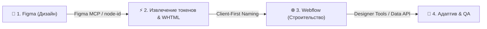

# 🚀 Пайплайн разработки: Figma ➔ Webflow (Client-First v2/v3) через MCP

Официальный регламент перенос дизайна из **Figma** в **Webflow** с использованием двух MCP-серверов (**Figma MCP** + **Webflow MCP**) и методологии верстки **Finsweet Client-First**.

---

## 🧭 Архитектурная схема пайплайна



---

## 📋 Пошаговый Регламент Работы

### 🎨 Шаг 1. Подготовка макетов в Figma
1. **Auto Layout**: Все блоки, секции и карточки верстаются в Figma строго с использованием Auto Layout (`Vertical` / `Horizontal`, `padding`, `gap`).
2. **Семантика слоев**: Фреймы называют понятными именами (`Header`, `Hero`, `Features`, `Footer`, `Card`).
3. **Дизайн-токены**: Цвета, размеры шрифтов и отступы привязываются к стилям/переменным Figma.
4. **Векторная графика**: Иконки и логотипы хранятся как чистые `Vector` / `Component` (без лишних растровых подложек).

---

### ⚡ Шаг 2. Анализ и извлечение через Figma MCP
1. Агент запрашивает ссылку на конкретный фрейм с `node-id` (например, `https://www.figma.com/design/.../Name?node-id=102-45`).
2. Считываются:
   * Метаданные структуры (`get_metadata`, `get_design_context`).
   * Значения цветов, типографики и отступов (`get_variable_defs`).
   * Векторы конвертируются в чистый **SVG**.

---

### 🌐 Шаг 3. Сборка в Webflow по методологии Client-First

Все классы и структура DOM создаются строго в соответствии с **Finsweet Client-First**:

#### 1. Базовая Иерархия Слоев (DOM Structure):
```text
page-wrapper
  └── main-wrapper
        └── section_[section-name]
              └── padding-global
                    └── container-[large|medium|small]
                          └── [section-name]_component
```

#### 2. Система наименования классов (Client-First Naming Rules):
* **Глобальные структуры**: `page-wrapper`, `main-wrapper`, `padding-global`, `container-large`, `padding-section-large`.
* **Специфичные компоненты**: `hero_component`, `hero_heading-wrapper`, `hero_card-list`, `features_item`.
* **Утилиты и токены**: `text-size-large`, `text-color-primary`, `heading-style-h1`, `button_primary`.

#### 3. Правила создания стилей через Webflow MCP:
* Все классы предварительно создаются через `data_style_tool create_style`.
* Стилевые свойства привязываются к Переменным Webflow (`variable_as_value`).
* Растровые изображения загружаются в Webflow Assets (`data_assets_tool`) с сохранением 2x качества.
* Иконки вставляются как инлайн SVG через `HtmlEmbed`.

---

### 📱 Шаг 4. Адаптивность и QA Проверка
1. **Брейкпоинты**: Настройка адаптивных стилей сверху вниз (`Desktop` ➔ `Tablet` ➔ `Mobile Landscape` ➔ `Mobile Portrait`).
2. **Аудит доступности**: Проверка контрастности шрифтов (`Accessibility_Audit`).
3. **SEO & Ссылки**: Проверка атрибутов изображений и ссылок (`Asset_Audit`, `Link_Checker`).

---

## 🛠️ Перечень используемых MCP Серверов и Скиллов

| Сервис / Скилл | Назначение |
| :--- | :--- |
| **`figma` MCP** | Извлечение фреймов, верстки, слоев и токенов из Figma |
| **`webflow` MCP** | Прямое управление элементами, стилями и CMS в Webflow |
| **`webflow-mcp:client-first-naming`** | Применение наименований по Finsweet Client-First v2/v3 |
| **`webflow-mcp:figma-to-webflow`** | Автоматизированный мост переноса верстки из Figma в Webflow |
| **`webflow-mcp:designer-tools`** | Строительство элементов и секций на холсте Designer |

---

> [!TIP]
> **Пример вызова для работы**:  
> *«Сверстай этот макет из Figma [Ссылка] в Webflow на страницу Home по методологии Client-First.»*
